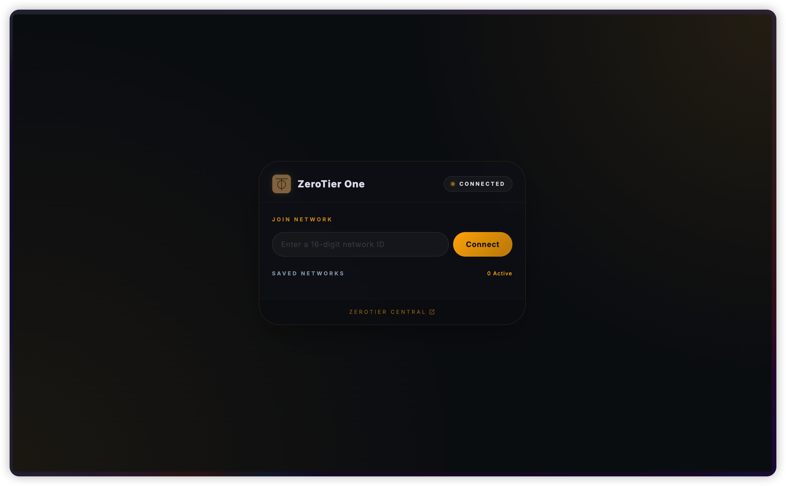
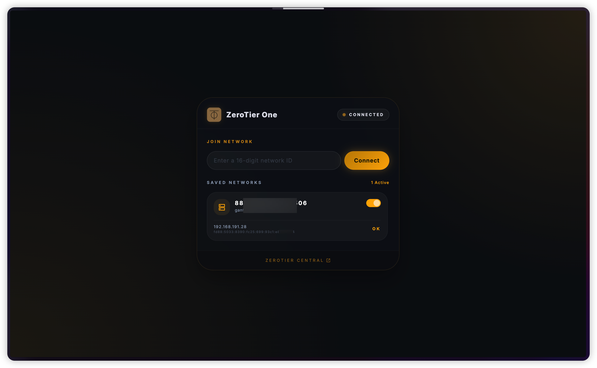

# ZeroTier One for fnOS

本应用是针对飞牛 fnOS 深度定制的 ZeroTier One 客户端，集成了高性能网络服务与现代化的 Web 管理界面。

## 🛠 功能概览

* **原生服务集成**：基于 fnOS 原生环境编译，确保 ZeroTier 守护进程在高并发数据传输下的稳定性。
* **可视化 Web 控制面板**：
  * **状态感知**：采用 CSS 动画实现"呼吸灯"逻辑，实时反馈服务运行状态。
  * **网络管理**：支持 16 位 Network ID 的快速加入。
  * **IP 追踪**：实时轮询 API，展示多网段下的虚拟局域网 IP 信息。
* **高性能穿透**：利用 P2P 直连技术，最大程度降低跨网访问延迟。

## ⚙️ 技术参数

* 默认监听端口：`9994` (TCP)
* 存储路径：配置文件持久化于 `/var/lib/zerotier-one`
* UI 框架：基于 Tailwind CSS 与 HTML5 Canvas 动效引擎

## 📝 开发者语

本插件致力于提升 fnOS 用户的组网体验，将原本隐匿在后台的二进制进程通过富有生命力的 UI 呈现出来。

## ⚖️ 开源协议

遵循 ZeroTier 相关开源协议与 MIT 协议。

## 📸 界面演示

### 主页

### 连接成功庆祝效果

### 已连接状态显示IP

## 🔧 安装

在 fnOS 应用市场手动安装：

1. 下载最新的 `zerotierone.fpk` 发布包
2. 在 fnOS 应用管理 → 手动安装 选择该文件
3. 等待安装完成后即可在应用列表找到 ZeroTier One
4. 点击打开进入 Web 管理界面

## 📋 兼容

* ✅ fnOS >= v0.x （兼容当前飞牛nas系统）
* ✅ 支持 x86_64 架构
