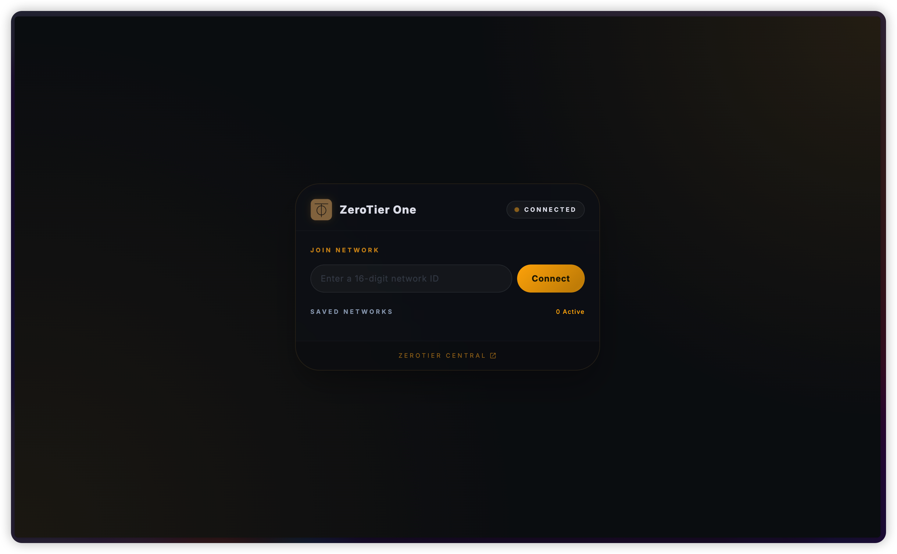
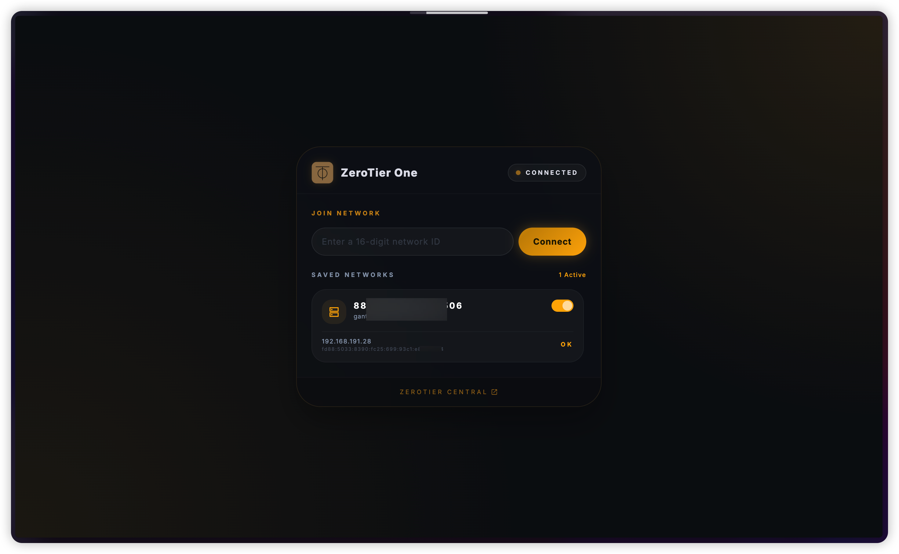

# ZeroTier One for fnOS

[English README](README-en.md) | 中文说明

> **基于 [ZeroTier One](https://github.com/zerotier/ZeroTierOne) 二次开发**
> 本应用是在 ZeroTier, LLC 开源的 [ZeroTier One](https://github.com/zerotier/ZeroTierOne) 基础上，针对飞牛 fnOS 深度定制封装的客户端（可视化 Web 管理界面 + fnOS 原生生命周期适配）。
> 底层网络核心、二进制与协议遵循 ZeroTier 相关开源许可证；本应用的上层封装与 UI 遵循 MIT 协议。
> 版权归属：网络核心 © ZeroTier, LLC；fnOS 适配层 © 梳油头的小男孩。

## 👥 开发者与发布者

| 角色 | 名称 | 链接 | 职责 |
|---|---|---|---|
| **开发者（上游）** | ZeroTier | https://github.com/zerotier/ZeroTierOne | ZeroTier One 网络核心、守护进程与协议实现 |
| **发布者（fnOS 适配）** | 梳油头的小男孩 | https://github.com/gantaogantao/ZeroTierOne-fnOS | 飞牛 fnOS 原生适配、可视化 Web 管理界面、应用打包与分发 |

本应用是针对飞牛 fnOS 深度定制的 ZeroTier One 客户端，集成了高性能网络服务与现代化的 Web 管理界面。

## 🛠 功能概览

* **原生服务集成**：基于 fnOS 原生环境编译，确保 ZeroTier 守护进程在高并发数据传输下的稳定性。
* **可视化 Web 控制面板**：
  * **状态感知**：采用 CSS 动画实现"呼吸灯"逻辑，实时反馈服务运行状态。
  * **网络管理**：支持 16 位 Network ID 的快速加入。
  * **IP 追踪**：实时轮询 API，展示多网段下的虚拟局域网 IP 信息。
* **高性能穿透**：利用 P2P 直连技术，最大程度降低跨网访问延迟。

## ⚙️ 技术参数

* 默认监听端口：`9994` (TCP)
* 存储路径：配置文件持久化于 `/var/lib/zerotier-one`
* UI 框架：基于 Tailwind CSS 与 HTML5 Canvas 动效引擎

## 📝 开发者语

本应用致力于提升 fnOS 用户的组网体验，将原本隐匿在后台的二进制进程通过富有生命力的 UI 呈现出来。

## ⚖️ 开源协议

遵循 ZeroTier 相关开源协议与 MIT 协议。

## 📸 界面演示

### 主页

### 连接成功庆祝效果

### 已连接状态显示IP

## 🔧 安装

在 fnOS 应用市场手动安装：

1. 下载最新的 `zerotierone.fpk` 发布包
2. 在 fnOS 应用管理 → 手动安装 选择该文件
3. 等待安装完成后即可在应用列表找到 ZeroTier One
4. 点击打开进入 Web 管理界面

## 📋 兼容

* ✅ fnOS >= v0.x （兼容当前飞牛nas系统）
* ✅ 支持 x86_64 架构

## 📝 更新日志

### v1.3.7
* **修正开发者 / 发布者署名**：应用详情页此前「开发者」与「发布者」显示为同一人且链接均指向 zerotier.com。现按飞牛 manifest 规范修正为——开发者：ZeroTier（上游 ZeroTier One 项目），发布者：梳油头的小男孩（fnOS 适配与分发），两者链接分别指向各自仓库。
* **图标改为符合飞牛设计规范的圆角矩形**：原图标为直角橙色方块满铺画布，在桌面上四角突兀。现重制为圆角矩形主体（圆角半径 22%、四角透明、主体留白 10%），与系统图标风格一致；同时补齐此前缺失的 64px 入口图标 `icon_64.png`。

### v1.3.6
* **修复 Web 管理界面偶发打不开**：Web 子进程（端口 9994）在某些环境下会静默退出，而原版健康检查只盯着 VPN 核心（9993），导致应用中心显示"运行中"但管理页实际已不可访问。
  * 新增 **Web 自愈看门狗**：应用启动后常驻一个轻量守护循环，每 30 秒检测一次 9994，发现未监听就自动重拉 Web 子进程，**不影响 VPN 组网（9993）**。
  * 应用停止时会一并清理看门狗与 Web 进程，无残留。
  * 如果你之前遇到"应用中心显示运行、但管理页打不开 / 点打开没反应"，升级到本版本后即可自愈，无需再手动停止→启动。
